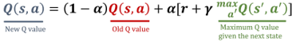

# 🚕 Q-Learning Taxi Agent 

This repository contains the code to train a Q-learning agent to solve the **Taxi-v3** environment from OpenAI Gymnasium. 
The agent interacts with the environment, learns an optimal policy through Q-learning, and visualizes its performance.

## ☝️ Requirements 

To run this project, the following is required:

- Python 3.6+
- Required libraries (install using `pip`):

```pip install gymnasium[toy_text] imageio numpy opencv-python
```

## 🚀 Project Overview 

This project implements Q-learning to train an agent in the **Taxi-v3** environment, which involves navigating a grid to pick up and drop off passengers at specific locations. 
The agent is trained for 2,000 episodes, and a policy is derived using the Q-learning algorithm. The agent's performance is tracked, and its behavior is visualized as a GIF.

<div align="center">
  
</div>

### Key Components:

- **Q-Learning Algorithm**: This reinforcement learning algorithm helps the agent learn by updating Q-values during each step based on the action taken, the reward received, and the next state.
  
- **Epsilon-Greedy Strategy**: A strategy where the agent explores the environment with a certain probability (`epsilon`) or exploits the best-known action based on the Q-values.
  
- **Training Loop**: The agent interacts with the environment over 2,000 episodes, gradually improving its policy.

- **GIF Visualization**: After training, the agent’s behavior is captured and saved as a GIF, allowing for easy visual inspection of its learning process.


4. **Visualize the behavior**:
   The agent’s behavior during training will be saved as `taxi_agent.gif` in the output directory.

## How Q-Learning Works in This Project

1. **State Representation**: The agent is trained in the **Taxi-v3** environment, where the state represents the location of the taxi, the passenger’s location, and whether the passenger is in the taxi or not.
  
2. **Actions**: The agent can take one of six actions: move north, south, east, west, pick up the passenger, or drop off the passenger.

3. **Reward**: The agent receives positive rewards for successfully picking up and dropping off passengers at the correct location. Negative rewards are given for illegal moves or unsuccessful attempts to drop off a passenger.

4. **Q-Table Update**: After each action, the Q-table is updated using the formula:
   ```python
   Q(state, action) = (1 - alpha) * Q(state, action) + alpha * (reward + gamma * max(Q(next_state, action)))
   ```
<div align="center">
  
</div>

   Where:
   - `alpha` is the learning rate.
   - `gamma` is the discount factor.
   - `reward` is the immediate reward after performing the action.

5. **Exploration and Exploitation**: The agent balances exploration and exploitation using an epsilon-greedy strategy, which decays the exploration rate (`epsilon`) over time.

## Visualizations

After training, a GIF of the agent's learned behavior is created to visually show its decision-making process over time.

## Contributing

Feel free to fork this repository, make improvements, or raise issues. Pull requests are welcome!

## 🙌 Acknowledgments

Thank you Fouad Trad from DataCamp for your support in this exciting project, and making it truly captivating.

